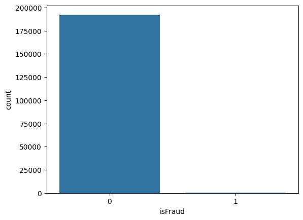
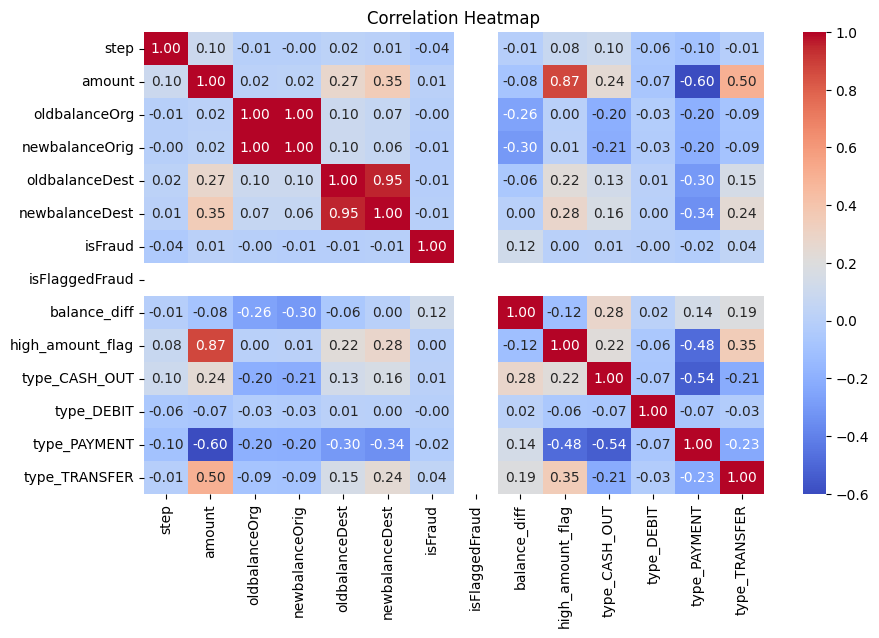
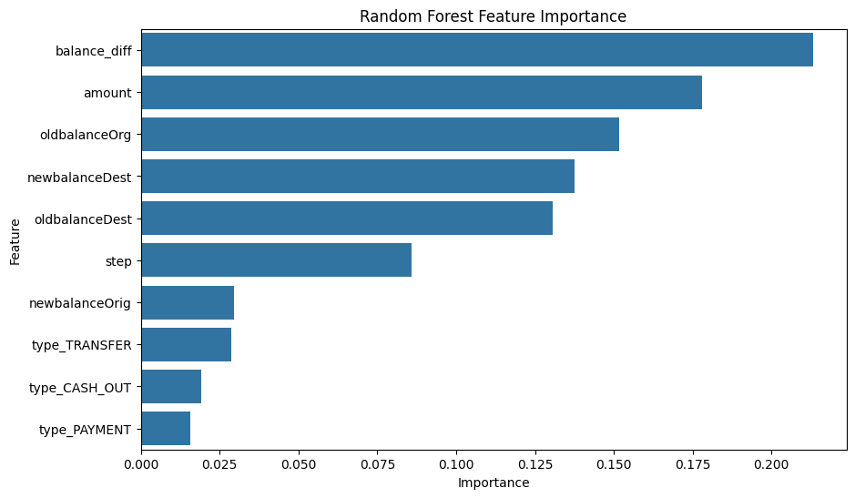

# 🏦 Online Payment Fraud Detection — End-to-End Capstone Project

## 📌 Project Overview
This project focuses on detecting fraudulent online payment transactions using
data preprocessing, exploratory data analysis (EDA), machine learning, and
model explainability techniques.

The objective is to build a robust fraud detection system that can accurately
identify fraudulent transactions from highly imbalanced data.

---

## 🎯 Problem Statement
Online payment fraud causes significant financial losses to businesses.
The challenge lies in detecting fraud transactions, which are extremely rare
compared to legitimate ones.

This project aims to solve that challenge using data analytics and machine
learning techniques.

---

## 📊 Dataset
- Online Payment Fraud Dataset
- Highly imbalanced target variable (`isFraud`)
- Cleaned and processed dataset used for modeling

> ⚠️ Note: Due to GitHub file size limits, the cleaned dataset is provided in ZIP format.

---

## 🛠 Tools & Technologies
- Python  
- Pandas, NumPy  
- Matplotlib, Seaborn  
- Scikit-learn  
- SMOTE (Imbalanced-learn)  
- XGBoost  

---

## 🔄 Project Workflow
1. Data Cleaning & Preprocessing  
2. Exploratory Data Analysis (EDA)  
3. Feature Engineering  
4. Machine Learning Model Building  
5. Handling Imbalanced Data using SMOTE  
6. Model Evaluation & Comparison  
7. Feature Importance & Explainability  
8. Business Insights & Final Recommendations  

---

## 🤖 Machine Learning Models Used
- Logistic Regression  
- Decision Tree  
- Random Forest  
- XGBoost  

---

## 📈 Key Results
- Fraud data is highly imbalanced
- Balance difference is a strong indicator of fraud
- XGBoost achieved the best recall for fraud detection
- SMOTE significantly improved fraud detection performance

---

## 🧠 Business Insights
- Fraud transactions generally involve higher transaction amounts
- Transfer and Cash-out transactions show higher fraud rates
- Balance mismatch is a strong fraud indicator
- Recall is more important than accuracy for fraud detection problems

---

## 📊 Key Visual Insights

### Fraud vs Non-Fraud Distribution

### Correlation Heatmap

### Feature Importance

## 📂 Repository Structure

Online-Payment-Fraud-Detection-Capstone/
│
├── data/
│ └── payment_fraud_clean.zip
│
├── notebooks/
│ ├── 1 - Data_Preprocessingipynb
│ ├── 2 - ML_Models.ipynb
│ ├── 3 - Imbalanced_ml_smote.ipynb
│ └── 4 - EDA_Explainability.ipynb
│
├── images/
│ ├── fraud_distribution.png
│ ├── feature_importance_xgb.png
│ ├── feature_importance_rf.png
│ ├── amt_vs_Frd.png
│ └── correlation_heatmap.png
│
└── README.md

---

## 🏆 Final Outcome
This project demonstrates a complete end-to-end fraud detection pipeline
from raw data to business insights, making it suitable for real-world
financial analytics applications.

⭐ This project is part of my Data Analytics & Machine Learning portfolio.
